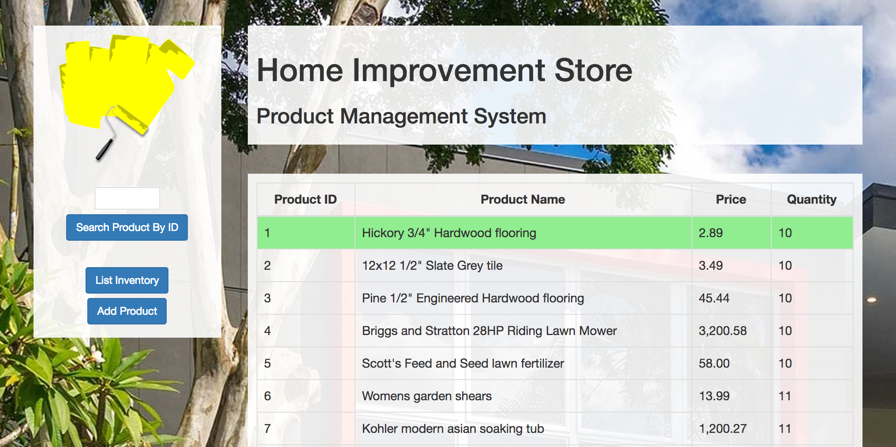
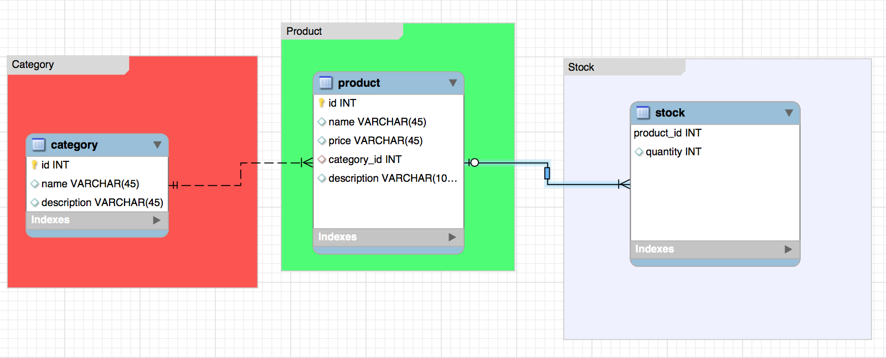

# home-improvement-store
A Spring MVC web application for inventory management at a home improvement store. An inventory manager can use the system to list current inventory, search the inventory by product id, add new products, update stock, and delete products from the database.

## In This Document:
1. [Application URL](#application-url)
2. [How to Use the Application](#how-touse-the-application)
3. [Technologies Used](#technologies-used)
4. [Data Model](#data-model)
5. [Future Feature Sets](#future-feature-sets)
6. [Stumbling and Learning Points](#stumbling-and-learning-points)

## Application URL
http://www.shaundashjian.com:8080/HomeImprovementStore/

## How to Use the Application
* The Inventory Manager opens the application and will see the inventory list
* Manager could select an item from the list to display more details about the product
* Manager could search the stock for a specific product by ID in the sidebar
* Manager could click on Add Product in the sidebar to be able to add a new product to the database
* After displaying product details, they could update product details and quantity in stock
  * Manager could also delete the product permanently from the database by clicking Delete

## Technologies Used
  * [Spring Web MVC framework](https://docs.spring.io/spring/docs/current/spring-framework-reference/html/mvc.html)
  * JSP with Bootstrap
  * Gradle
  * MySQL
  
## Data Model

## Future Feature Sets:
  * The ability to add new product categories to the system
  * Alerts when quantity in stock is low or reaches a certain level
  * Information about the date an item was added or updated
  * Search by product name functionality
  
## Stumbling and Learning Points:
  * Ensuring that the database server is active
  * Getting better using SQL
  

[Up](README.md)
